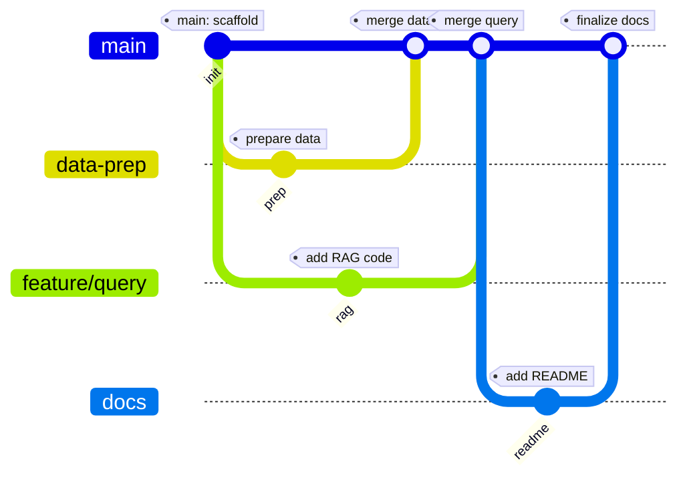

# Build Your Own Custom Chatbot

A Udacity project to build a custom OpenAI-powered chatbot “under the hood” using only basic Python packages (`openai`, `pandas`) and your own dataset.

---

## 📈 Project Workflow



---

## 🛠 What You’ll Build

1. **Custom RAG Chatbot**

   * Load your chosen dataset (Wikipedia API or CSV) into a `pandas.DataFrame`
   * Index it for retrieval (e.g., embeddings + similarity search)
   * Wrap it in a simple chat loop using the legacy `openai` v0 API

2. **Before vs. After Demo**

   * Two sample questions showing how responses improve once your custom data is integrated

---

## 🚀 Getting Started

1. **Clone the repo**

   ```bash
   git clone https://github.com/hugom18/build-your-own-custom-chatbot.git
   cd build-your-own-custom-chatbot
   ```

2. **Install dependencies**

   ```bash
   pip install -r requirements.txt
   ```

   > **Note:** This project uses `openai==0.x` (legacy). If you have `openai>=1.0`, uninstall first:
   >
   > ```bash
   > pip uninstall openai
   > pip install openai==0.27.0
   > ```

3. **Prepare your dataset**

   * Ensure your CSV (or API script) outputs a DataFrame with a `text` column.
   * Place it in `/data` and update the path in `project.ipynb`.

4. **Run the notebook**

   ```bash
   jupyter lab project.ipynb
   ```

   * Fill in the **TODO** cells for:

     1. Dataset choice & scenario write-up
     2. Data loading & formatting
     3. Custom query integration
     4. Q\&A comparisons “before” vs. “after”

5. **Sanitize your API key**

   * Replace your OpenAI key with `YOUR_API_KEY` before sharing or submission.

---

## 📂 Data

Place your cleaned CSV (≥20 text rows) in `/data` and ensure it has a `text` column:

```
data/
├── 2023_fashion_trends.csv
├── character_descriptions.csv
└── nyc_food_scrap_drop_off_sites.csv
```

You may also source your own data—just reshape it to a single `text` column.

---

## 💡 Tips & Tricks

* Use `gitGraph` (Mermaid) blocks to visualize your branching model.
* Commit often with clear messages (e.g., `git commit -m "add data prep script"`).
* Enable GitHub Pages (Settings ▶ Pages ▶ deploy from `main`) to host a rendered site.
* Leverage `raw.githubusercontent.com` for machine-readable raw Markdown.

---

## 🎓 Submission

Once complete:

1. Remove your API key.
2. Push to GitHub.
3. Submit via the Udacity workspace or link your repo on the project submission page.

Good luck, and happy building! 🎉
